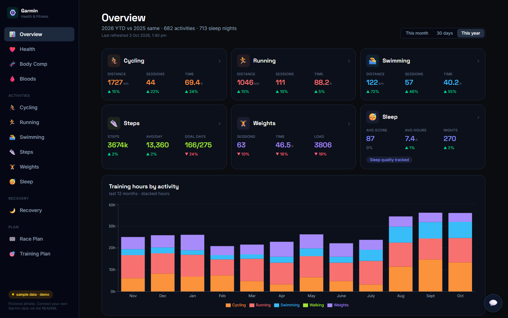
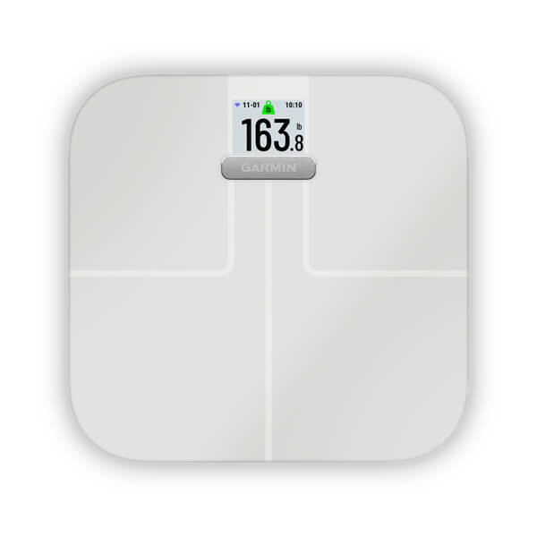
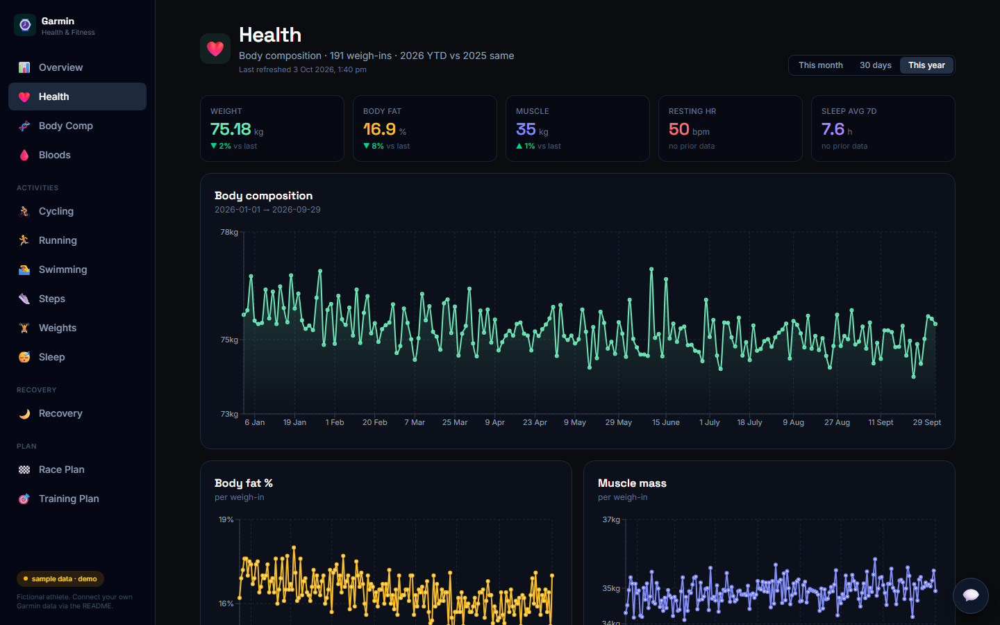
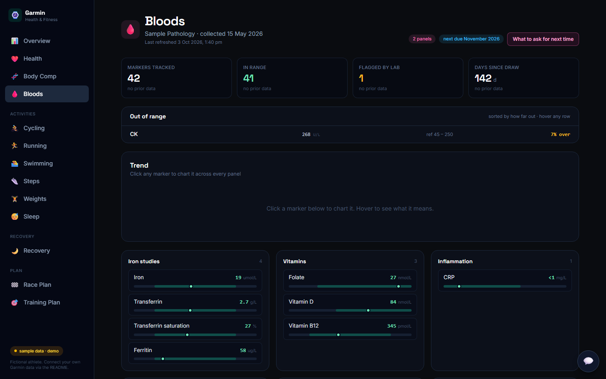
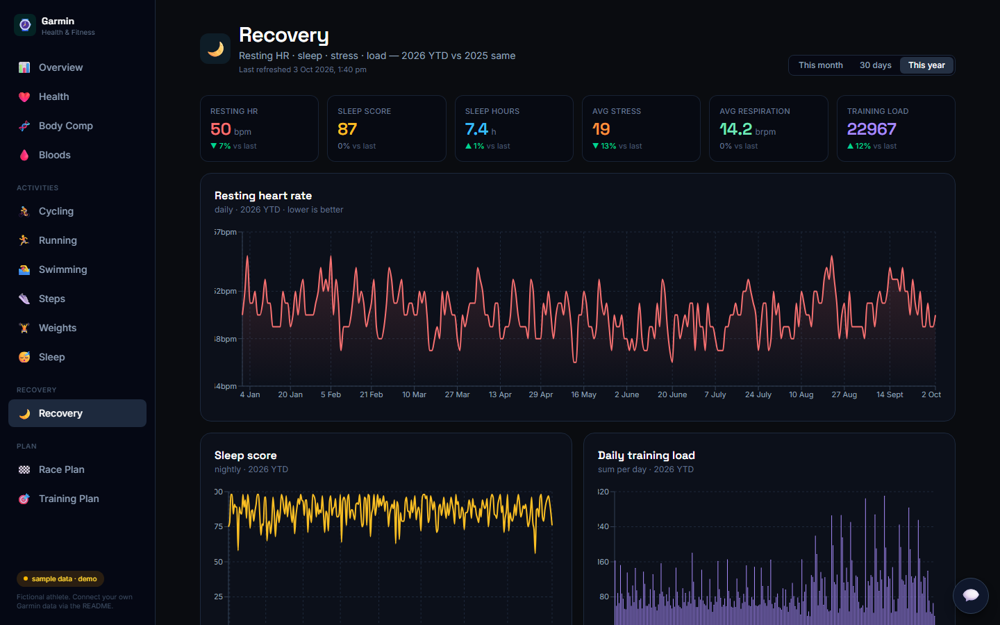
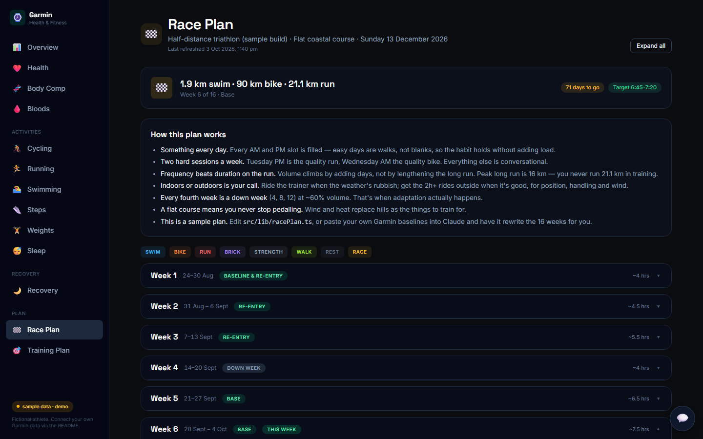

# Garmin + Claude dashboard

The personal health dashboard from the **Garmin x Claude** video: every run, ride and swim,
sleep, resting heart rate, steps, training load, body composition off the scale, blood work,
a 16-week race plan, and a Claude coach that reads it all and answers like a coach.

This repo is a **working copy with sample data** so you can click around before you connect
anything, then point it at your own Garmin data in one config step.

**Live demo (sample data, fictional athlete):** https://garmin-claude-dashboard.vercel.app

[](https://garmin-claude-dashboard.vercel.app)

> Built by [Aaron Automates](https://aaronautomates.com.au). Data pull lives in its own repo:
> [garmin-claude-coach](https://github.com/aaronparton2-sketch/garmin-claude-coach).
> Free build guide (PDF) at https://aaronautomates.com.au/garmin

---

## Read this first

### Most Garmin watches cover almost all of it

Sleep, HRV, resting heart rate, steps, Body Battery, stress, intensity minutes and every
activity come from **the watch**. Any recent Garmin watch that syncs to Garmin Connect
(Forerunner, Fenix, Venu, Instinct, Vivoactive, Epix, Enduro...) will feed this dashboard.

### Weight and body composition need the Garmin Index S2 smart scale



The **Health**, **Body Comp** and weigh-in parts of the dashboard (weight trend, body fat %,
muscle mass, body water, bone mass) come from the
**[Garmin Index S2](https://www.garmin.com/en-AU/p/679362/)** scale, not the watch.
The scale weighs you, estimates body composition by bioimpedance, and syncs over Wi-Fi to
the same Garmin Connect account, where the daily pull picks it up as `INDEX_SCALE` rows.

No scale, no body-comp numbers. Everything else still works, and those cards simply stay empty.
Weight typed into the Connect app by hand does flow through, but with no body fat or muscle.

*Image: Garmin. Product page: https://www.garmin.com/en-AU/p/679362/*

<br clear="right">

### ⚠️ This uses an unofficial route into Garmin. Proceed at your own risk.

Garmin's official API is for approved commercial partners only. The daily pull in
[garmin-claude-coach](https://github.com/aaronparton2-sketch/garmin-claude-coach) logs into
Garmin Connect **as you**, with your own username and password, through the community
`python-garminconnect` library, and reads the same data the Connect app shows you.

That is **not an approved integration and it goes against Garmin's Terms of Use.** The data is
yours, but the method is unofficial: Garmin may change or block it at any time, and could in
principle restrict an account that uses it. Nobody I know of has had that happen, and the
library has been in wide use for years, but you are taking that risk, not me. Practical rules:

- use a **strong, unique password** on your Garmin account and never share the credentials;
- keep the credentials in `.env` (gitignored) or a secrets manager, never in code or a browser;
- run the pull once a day, not every few minutes (Garmin rate-limits logins; a `429` means back off);
- if you are not comfortable with any of that, use Garmin's manual **Export Your Data** instead.
  Slower, but fully official. The `etl/load_export.py` script parses that export into the same tables.

---

## What's on it

| Page | What it shows | Source |
|---|---|---|
| **Overview** | Period cards per sport (distance, sessions, time, deltas vs last period), sleep and steps cards, 12-month stacked hours | watch |
| **Health** | Weight, body fat, muscle with trend lines, resting HR and steps over 60 days | **Index S2** + watch |
| **Body Comp** | DEXA scan vs scale, the scale's measured bias, corrected body fat, bone density | **Index S2** + your DEXA rows |
| **Bloods** | Pathology panels as position bars, flagged markers quantified, trend per marker, printable "what to ask for next time" sheet | your blood results |
| **Cycling / Running / Swimming / Weights** | Monthly volume, per-session distance and HR, pace trend, recent sessions (indoor sessions kept out of pace maths) | watch |
| **Steps** | Daily steps vs goal, monthly averages, floors | watch |
| **Sleep** | Hours and score, stages (deep / light / REM / awake) over 60 nights | watch |
| **Recovery** | Resting HR, sleep score, stress, respiration, daily training load | watch |
| **Race Plan** | A 16-week day-by-day half-distance triathlon build, current week highlighted | template, edit it |
| **Training Plan** | Weekly targets per sport vs what you actually did this week | your targets |
| **AI Coach** (chat bubble) | Ask anything; Claude answers off your last 30 days | Claude API |

Every page has a **This month / 30 days / This year** slicer with like-for-like comparison to the
previous window.

| | |
|---|---|
|  |  |
|  |  |

More in [`docs/screenshots/`](docs/screenshots/), including phone-width captures.

---

## How the pieces fit

```
Watch / Index S2  ->  Garmin Connect  ->  garmin-claude-coach (daily pull)  ->  Supabase  ->  THIS DASHBOARD  ->  Claude coach
                                                                                 (your tables)      (reads them via /api)
```

1. **[garmin-claude-coach](https://github.com/aaronparton2-sketch/garmin-claude-coach)** pulls your
   data once a day and upserts it into four Supabase tables (`garmin_activities`, `garmin_sleep`,
   `garmin_daily_summary`, `garmin_weigh_ins`). Its README has the pull setup, the n8n workflow
   and the 18-prompt coaching pack.
2. **This repo** is the front end. A tiny serverless layer (`api/`) reads those tables with a
   server-side key and hands the browser one JSON bundle. No key and no health data ever ship in
   the public bundle.
3. **Claude** sits behind `api/chat.js`, gets the last 30 days compacted into a prompt, and answers.

With no Supabase configured the same `api/` routes serve `data/sample/` instead. That is the demo.

---

## Run it locally (sample data, 2 minutes)

```bash
git clone https://github.com/aaronparton2-sketch/garmin-claude-dashboard
cd garmin-claude-dashboard
npm install
npm run dev          # http://localhost:5173
```

That's it. `vite.config.ts` runs the same `/api/*` routes locally, so you get the full dashboard
on the fictional athlete with no accounts and no keys.

Regenerate the sample set any time (it is deterministic):

```bash
python scripts/generate_sample_data.py          # writes data/sample/*.json
```

---

## Deploy your own copy (free, ~5 minutes)

The dashboard is a static Vite app plus three Vercel functions. Vercel's free tier is plenty.

**One-click:**

[](https://vercel.com/new/clone?repository-url=https%3A%2F%2Fgithub.com%2Faaronparton2-sketch%2Fgarmin-claude-dashboard&project-name=garmin-claude-dashboard&repository-name=garmin-claude-dashboard)

**Or from the terminal:**

```bash
npm i -g vercel
vercel login
vercel deploy --prod
```

Either way you get a URL running the sample data. Then connect your own data (next section) and
redeploy. Netlify, Cloudflare Pages or any host that runs Node functions in `api/` works too.

---

## Connect your own Garmin data

1. **Set up the pull.** Follow [garmin-claude-coach](https://github.com/aaronparton2-sketch/garmin-claude-coach):
   create a free Supabase project, paste its `schema.sql`, run `garmin_daily_pull.py --days 365`
   once to backfill, then schedule it daily (Task Scheduler, cron, or the included n8n workflow).
   This repo's [`sql/schema.sql`](sql/schema.sql) creates the same four tables plus the optional
   `dexa_scans` table; [`sql/blood_panels.sql`](sql/blood_panels.sql) adds blood work.
2. **Give the dashboard the keys.** In Vercel: Project -> Settings -> Environment Variables
   (or `.env` locally, see [`.env.example`](.env.example)):

   | Variable | What | Required |
   |---|---|---|
   | `GARMIN_SUPABASE_URL` | `https://<ref>.supabase.co` of the project the pull writes to | to go live |
   | `GARMIN_SUPABASE_SERVICE_ROLE_KEY` | that project's `service_role` key (server-side only, never in the browser) | to go live |
   | `GH_PASSWORD` | a password for the dashboard. Set it: this is your health data on a public URL | strongly recommended |
   | `GH_SESSION_TOKEN` | any long random string, used as the login cookie value | with `GH_PASSWORD` |
   | `ANTHROPIC_API_KEY` | enables the AI coach chat | optional |
   | `ANTHROPIC_MODEL` | defaults to `claude-haiku-4-5-20251001` | optional |

3. **Redeploy.** The badge in the sidebar flips from `sample data · demo` to `live · supabase`.

The moment both `GARMIN_SUPABASE_*` values exist the sample data is ignored. There is nothing to
delete.

**Have a Garmin data export instead of the pull?** Request it at
garmin.com -> Account -> Export Your Data, unzip it, then
`python etl/load_export.py --export "/path/to/export" --supabase` loads it into the same tables.

### DEXA and bloods (optional)

These two pages have no automated source; they are small tables you fill by hand (or ask Claude
to turn a PDF report into the insert statement). Shapes are in `sql/schema.sql` (`dexa_scans`) and
`sql/blood_panels.sql`. The sample rows in `data/sample/` show the exact JSON per marker.
With no rows, both pages show a short "nothing yet" note.

---

## AI coach

The chat bubble posts to `api/chat.js`, which reads the last 30 days (daily, sleep, 20 activities,
10 weigh-ins), compacts them, and asks Claude to answer as a coach. Read-only, server-side,
~1k tokens a question.

- No `ANTHROPIC_API_KEY` set: the chat answers with a short "add your key" note and never errors.
  That is how the public demo runs.
- Keys come from https://console.anthropic.com. Put the key in Vercel's env vars, redeploy, done.
- **Never** commit the key or put it in `VITE_*` variables; anything prefixed `VITE_` is inlined
  into the public bundle.

The system prompt is a dozen lines at the bottom of `api/chat.js`. Change the voice there.

---

## Project layout

```
api/            Vercel functions: data.js (bundle), chat.js (coach), login.js (optional gate), _bundle.js (shared)
src/            Vite + React 19 + TypeScript + Tailwind v4 + Recharts
  pages/        one file per page
  lib/          data types, period maths, plan + race plan templates, blood marker reference
data/sample/    generated fictional dataset the demo serves (git-tracked)
scripts/        generate_sample_data.py
sql/            schema.sql, blood_panels.sql
etl/            load_export.py (Garmin export -> JSON/Supabase), gen_setup_sql.py
docs/           screenshots + the Index S2 photo
```

**Make it yours:** the race plan is `src/lib/racePlan.ts` (change `RACE_DATE` and every week re-dates
itself), the weekly targets seed is `src/lib/plan.ts`, and the blood-test request sheet is
`src/lib/next-panel.ts`. All three are templates written for a fictional athlete. The fastest way to
personalise them is to paste the file plus your own numbers into Claude and ask for a rewrite.

---

## Privacy notes

- The browser only ever receives what `/api/data` returns. Keys stay in Vercel env vars.
- With `GH_PASSWORD` set, every data route returns 401 until the httpOnly session cookie exists.
- `.vercelignore` keeps `.env`, `etl/`, `sql/` and your own `data/*.json` out of the upload.
- This repo contains **no real health data**. Everything in `data/sample/` is generated.

## Licence

MIT. Do what you like with it. The Garmin Index S2 photo is Garmin's.
Not affiliated with or endorsed by Garmin or Anthropic. Training advice from the coach is not medical advice.
